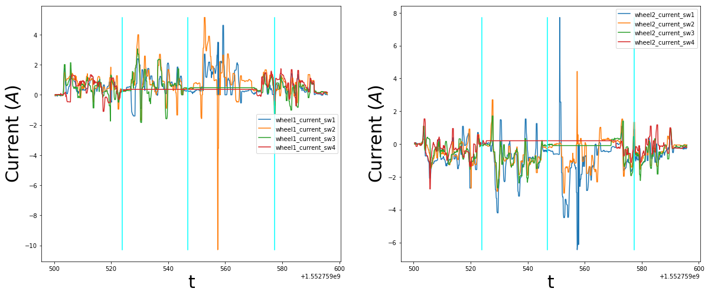
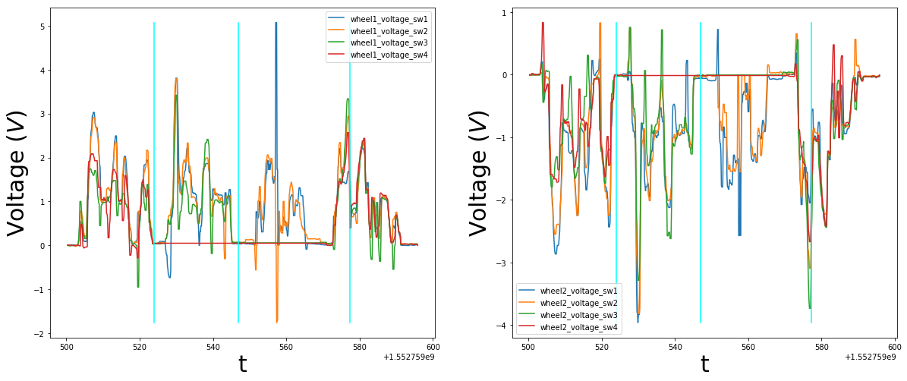
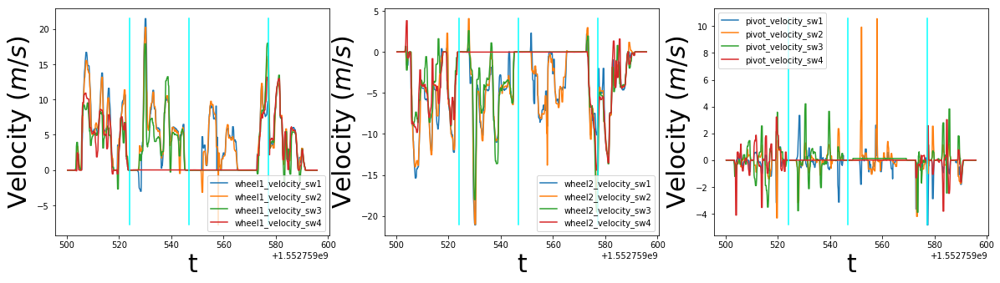
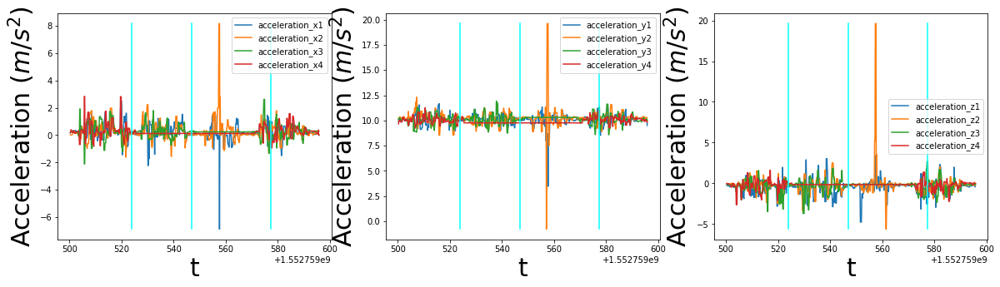
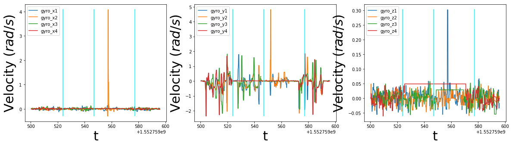

# Metadata

|                   |                                                                   |
|-------------------|-------------------------------------------------------------------|
| Brief description | Black box data including disconnected and then reconnected wheels |
| Platform          | ropod_002 (Frank)                                                 |
| Date and time     | 16.03.2019, 19:05:00 - 19:06:35                                   |
| Location          | HBRS, C022 lab                                                    |
| Surface           | Laminate                                                          |
| Experimenter(s)   | Alex Mitrevski, HBRS                                              |

# Setup description

The robot was commanded to move inside the lab using a joypad, such that wheel 3 and later wheel 4 were disconnected and then reconnected back. Near each event of interest, a joypad event was triggered for the purpose of data annotation.

# Included data

* Smart wheel data (719 records)
* Velocity commands (423 records)
* Odometry measurements (1770 records)
* Laser scan measurements (331 records)
* Manually triggered events (3 records)

# Data plots

The plotted data are filtered using a median filter with window size 3. The points of disconnecting/connecting the wheels are annotated in the plots by vertical lines (green in the velocity plot, cyan in all other plots); only one event for reconnecting the wheels was triggered since the wheels were connected in quick succession and the robot was not moving during that time.

## Wheel currents

## Wheel voltages

## Wheel velocities

## Wheel accelerations

## Wheel gyro measurements

