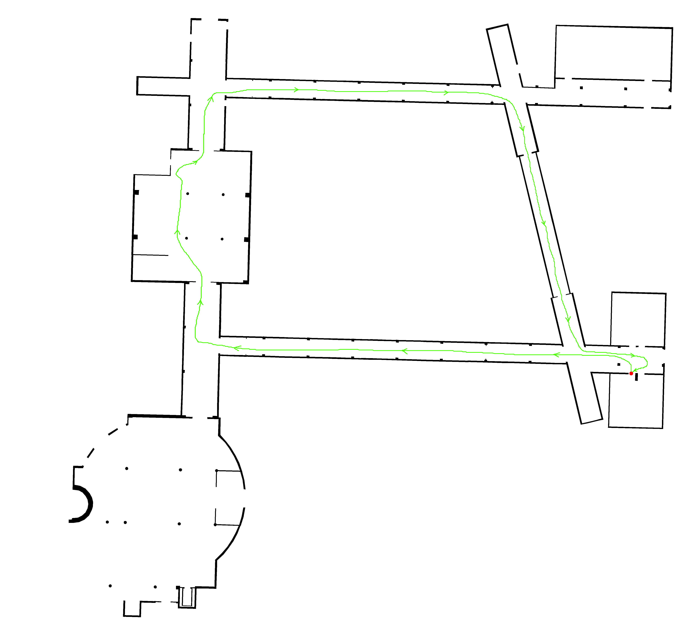
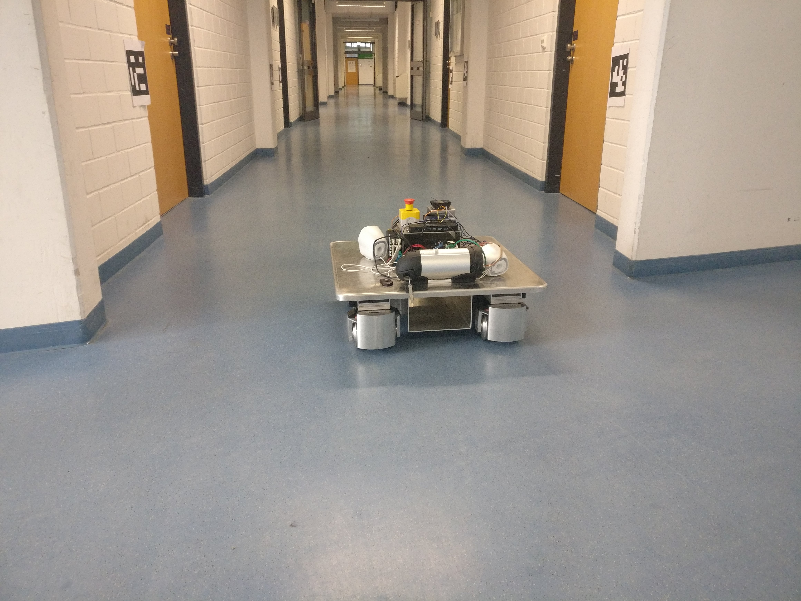
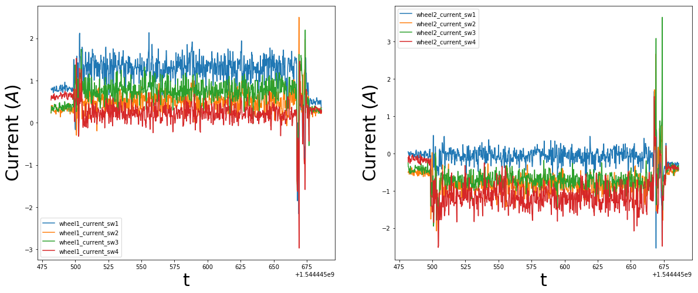
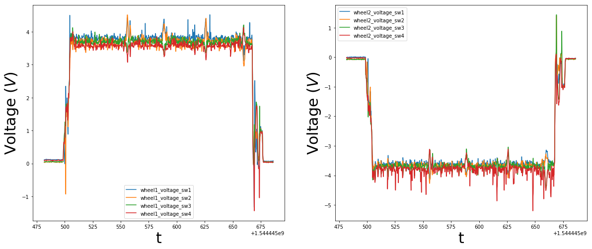
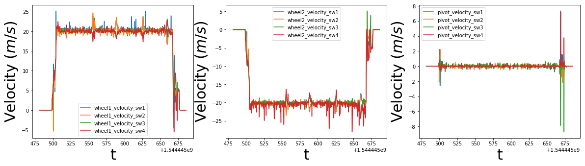
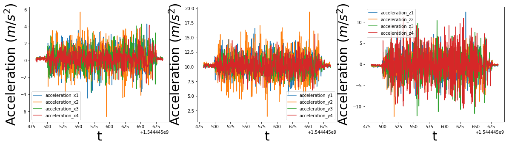
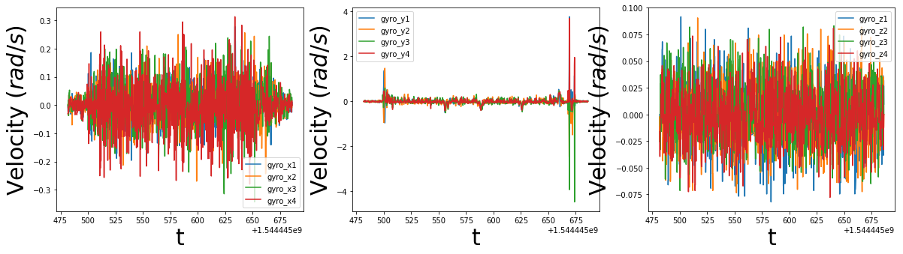

# Metadata

|                   |                                                              |
|-------------------|--------------------------------------------------------------|
| Brief description | Black box data from nominal base motion at HBRS              |
| Platform          | ropod_002 (Frank)                                            |
| Date and time     | 10.12.2018, 13:38:01 - 13:41:26                              |
| Location          | HBRS, C building, ground floor                               |
| Surface           | Vinyl                                                        |
| Collected by      | Alex Mitrevski, HBRS                                         |

# Setup description

The robot was commanded to navigate from the entrance of the C022 lab through the C building and back to the lab using a joypad. There were no sudden changes of direction during the motion, i.e. direction changes were done smoothly.

The rough trajectory over which the robot moved (hand-drawn) is shown below (the red dot denotes the start and end point of the motion):

One of the hallways in the environment is shown below:

# Included data

* Smart wheel data (1464 records)
* Velocity commands (1091 records)
* Odometry measurements (838 records)
* Laser scan measurements (185 records)

# Data plots

The plotted data are filtered using a median filter with window size 3.

## Wheel currents

## Wheel voltages

## Wheel velocities

## Wheel accelerations

## Wheel gyro measurements

